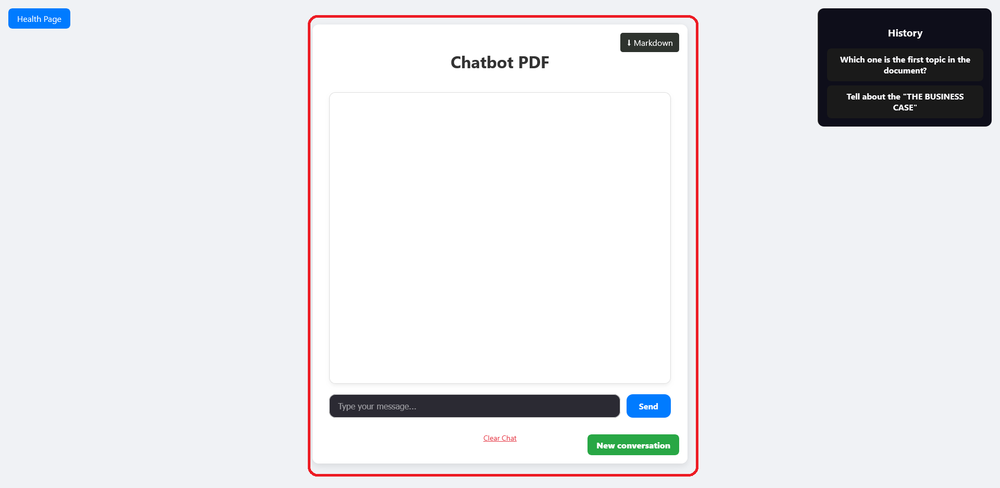
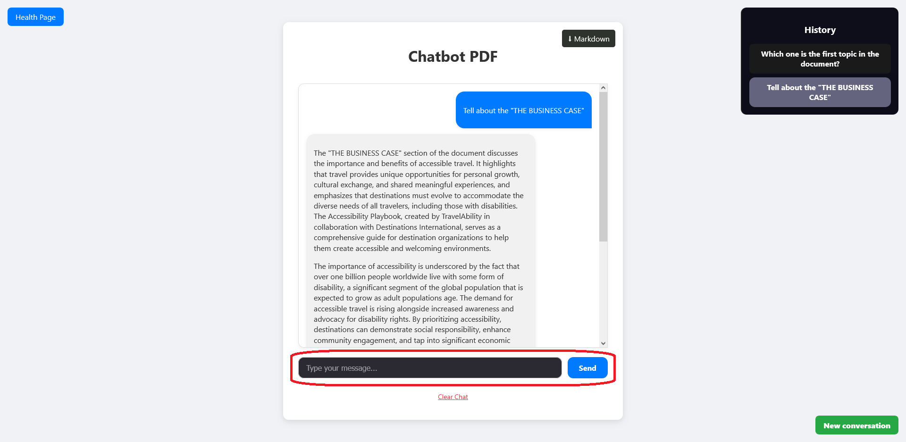
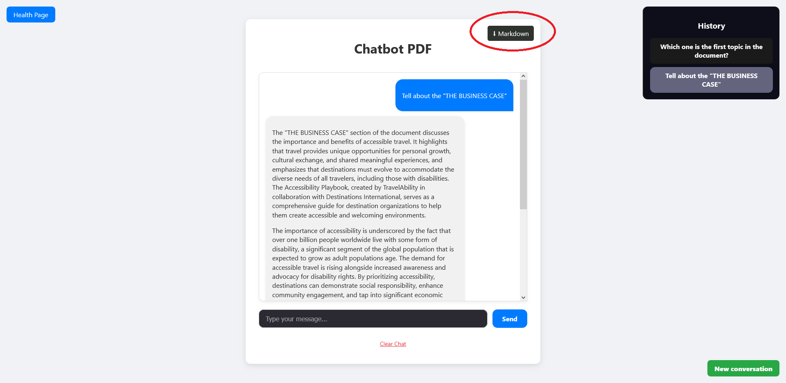
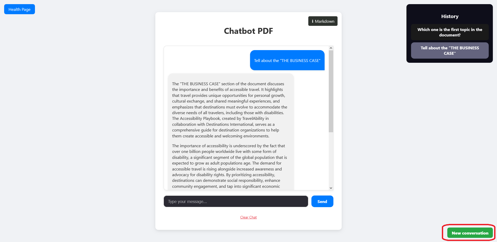
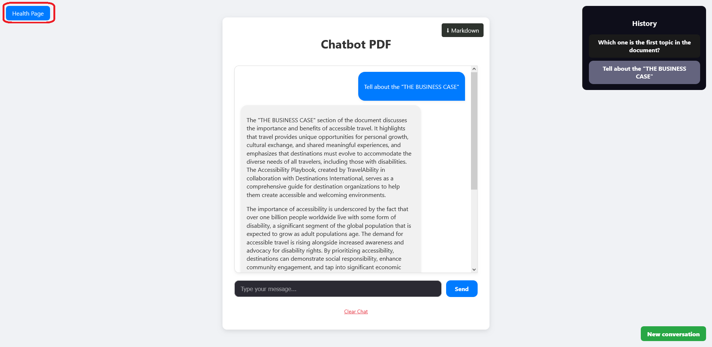

# Setup Instructions

### Backend

      cd backend
      pip install -r requirements.txt
      uvicorn main:app --reload

### Frontend

      cd frontend
      npm install
      npm run dev

## .env

Please, review the env.example in both apps to check the notes, the most important one is to add the OpenAI Api key to the backend.

---

# Documentation

## Project Structure

In both apps, the structure of the project is think it to be modular, scalable, and looking for clean code. The solution for both backend and frontend use folders like models, routers, utils, services, hooks and others. The reason is for looking separate reposanbilities and make the code easier to read by modules.

## Challenges faced and solutions

#### 🧠 Token reduction

One of the main challenges in this project was the high token cost when sending the full document to the language model. Initially, we tackled this by splitting the document into chunks and using keyword matching (**keyword_search.py**) to select the most relevant ones. While this reduced token usage, it had major limitations:

- It relied on exact word matches.

- Missed semantically related content.

- Produced irrelevant or incomplete results if phrasing differed.

To improve relevance and efficiency, we switched to a semantic search approach using embeddings (**embedding_store.py**). This method converts both the user's question and document chunks into vector representations and selects the most similar ones based on cosine similarity.
Benefits of Using Embeddings:

- Understands semantic meaning, not just keywords.

- Selects contextually relevant chunks.

- Greatly reduces token usage while improving answer quality.

- Enables scalability and better user experience.

#### 💬 Real-Time Conversation and State Management

Chat state management on the frontend was another major challenge, especially ensuring that:

- Conversations could be resumed.

- Messages flowed naturally with a simulated "typing" effect.

- Responses arrived in chunks via Server-Sent Events (SSE), which required progressive processing.

**Solution:**
A custom hook (useChat) was created that encapsulates all chat management logic:

- Handles multiple conversations (fetchConversations, handleLoadMessages).

- Allows chats to be cleaned up, created, and switched.

- Sends messages to the backend and processes responses in streaming.

- Simulates the typing effect by progressively adding content (typing role).

- Manages errors and loading states, and maintains a fluid interface.

**Impact:**

- Significant improvement in the user experience.

- Better code organization thanks to the separation of responsibilities.

- Ability to scale to future features such as persistent users or history.

## Requirements

#### 1. Frontend (React)

✅ Single page chat interface with:

- Message input field
- Send button
- Chat history display (user and AI messages)
- Clear/reset conversation button

✅ Clean, responsive design (can use any CSS framework or plain CSS).
✅ Real-time streaming of AI responses (bonus: show typing indicator).
✅ Messages should be clearly distinguished (user vs AI).

#### 2. Backend (FastAPI)

✅ Single endpoint for chat messages: POST /chat.
✅ PDF context loading on startup sera entregado por separado.
✅ Integration with OpenAI or Anthropic API (API keys will be provided).
✅ Streaming response support using Server-Sent Events (SSE).
✅ In-memory conversation history (no database required).
✅ Health check endpoint: GET /health.

#### 3. Context Handling

✅ Load and parse the provided PDF on server startup.
✅ Include the PDF content as context in all AI API calls.
✅ Ensure the AI can accurately answer questions about the PDF content.

#### 4. Bonus

✅ Multiple conversation support (switch between different chat sessions) - **There is a only user (no login system)**.
✅ Token/cost tracking display for API usage - **It's show in API console (estimated)**.
✅ Export conversation to text/markdown.
✅ Loading states and better error handling UI.
❌ Simple rate limiting on the backend.
✅ Markdown rendering for AI responses.

## Posible Improvements

#### 1. Use of a Vector Database (Vector DB):

Implement a solution such as FAISS or ChromaDB to manage embeddings in a more scalable and efficient manner, enabling faster and more accurate searches.

#### 2. Optimize embedding and chunk design:

Refine chunking logic (e.g., with sliding windows) and adjust embeddings to improve answer relevance in complex questions.

#### 3. User and login system:

Add authentication and session management to offer a personalized experience and conversation persistence.

#### 4. More attractive and professional interface design:

Improve the application's visual appearance with a more polished, responsive, and user-friendly design.

## Use examples and pictures

In this section, we will walk through the functionalities and parts of the application, guided by annotated images.

### 📄 1. Chat

This screen shows the interface where the user can see the msg that it sends.

---

### 💬 2. Sending a Message

Users can type a question related to the content of the PDF.

---

### 🗑️ 3. Clear a Conversation

Users can clear the conversation use with caution.

---

### 🔽 4. Download

Download the current conversation in MarkDown format.

---

### 📁 5. Conversation History

Each conversation is saved and can be revisited. This shows multiple conversations listed.
**This application don't have DB so be careful with backend realoads**

---

### 🗨 6. New conversation

Simple button to create a new conversation. Clear the previous show it conversation

---

### 🎯 7. Health

This button is only to checkt the backend status.

